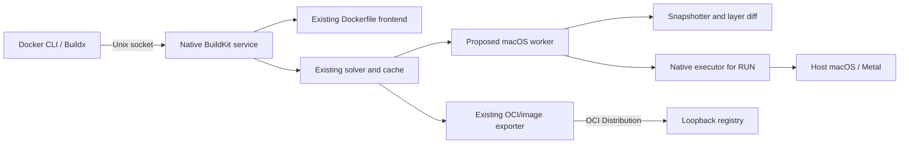

# Native macOS image builder: architecture proposal

**Status:** Draft for human review. A limited BuildKit worker experiment is
documented in [BUILDKIT_PROTOTYPE.md](BUILDKIT_PROTOTYPE.md); the full builder
architecture remains under review.
**Target host and image platform:** macOS on Apple Silicon; `darwin/arm64`.
**Implementation language:** Go, with native macOS facilities where needed.
**Updated:** 2026-09-29.

## 1. Purpose and success criterion

Build and publish `darwin/arm64` OCI images for trusted native macOS
applications without a Linux VM. The first representative workload is
`go-inf-server`, which wraps llama.cpp and uses Metal on this Mac. A minimal
[local OCI runner](RUNNER.md) and [Docker API service](DOCKER_RUNTIME.md) now
launch the tiny CPU example through `docker run`; a full Docker-compatible
runtime is a later project phase. This document covers the builder.

The build interface is the installed, unmodified Docker CLI through Buildx
remote and a regular Dockerfile. The intended workflow is:

```text
docker buildx create --name macnative --driver remote \
  unix:///path/to/native-buildkit.sock
docker buildx build --builder macnative --platform darwin/arm64 \
  -t 127.0.0.1:5000/go-inf-server:smollm2 --push .
```

The commands above are a target, **not commands that work today**. Buildx
remote connects directly to an independently managed BuildKit service; its
name does not imply another machine. Both the service and registry would run
on this Mac. `--push` publishes the build result to the local registry;
loading it into Docker Desktop's image store is not part of this workflow.
The local registry listens only on `127.0.0.1`.

Successful delivery means the Docker CLI sends a build, the builder interprets
the Dockerfile, emits a valid `darwin/arm64` OCI image, the image can be pushed
to and pulled from the local registry. A `FROM scratch` packaging build is the
first integration case; a build that compiles with native `RUN` is a separate,
mandatory acceptance case. Demonstrating Metal access from a staged image
root is a feasibility test for the build worker and eventual runtime.

## 2. Scope and assumptions

| Area | Proposed boundary |
| --- | --- |
| Trust | Images and build contexts are trusted. This does not remove the need to prevent accidental writes outside build working directories. |
| Host | One macOS arm64 machine. No Linux kernel, Linux VM, or remote builder. |
| Images | OCI image format with platform `darwin/arm64`. Linux base images are rejected for native build execution. |
| Network | Registry and BuildKit service local to this Mac. The registry currently uses loopback HTTP; Buildx remote connects through a Unix socket. |
| First workload | `go-inf-server`, including its arm64 Mach-O binary, dylibs, configuration, and one GGUF model. |
| Later work | Broader Docker Engine API and runtime lifecycle, image import and registry pull, process and network isolation, and Kubernetes integration. The tiny image already has a limited `docker run`, `ps`, and `logs` path. |

OCI defines an image manifest, configuration, and filesystem layers; its
configuration permits `darwin` and `arm64` as OS and architecture values.
These bytes describe an image. They do not, by themselves, provide native
process isolation, root filesystem semantics, or a Docker daemon.

## 3. Current implementation, kept distinct from the target

| Component | Current state | Gap |
| --- | --- | --- |
| Image packager (`cmd/imgbuild`) | Packages one prebuilt `go-inf-server` payload into an OCI layout with two layers. The extracted payload has run against the host Metal device. | No Dockerfile parsing, build context, `RUN`, or Docker CLI endpoint. |
| Registry (`cmd/registry`) | Loopback OCI Distribution subset with persistent blobs and tags. The sample image was uploaded and its tag and manifest read back. | Incomplete Distribution API, including chunked uploads, indexes, attestations, and broad client compatibility. |
| Publisher (`cmd/imgpush`) | Uploads the existing sample layout to the registry. | Temporary bridge; not the intended build interface. |
| BuildKit service | Pinned v0.24.0 prototype accepts Buildx remote on a Unix socket and exports a CPU `RUN` image. | General Dockerfile and registry push behavior are unvalidated. |
| Native build worker | Experimental Darwin worker runs host `/bin/sh` under Seatbelt with writes limited to a snapshot directory. | No image-root view, full containment boundary, or verified Metal access. |
| Local runner (`cmd/imgrun`) | Launches the tiny Buildx OCI tarball on this Mac and forwards its process output and signals. | Only regular files and directories, relative entrypoint, no image-root view or Docker API. |
| Docker API service (`cmd/macd`) | Registers one local image and supports `docker --context macnative run`, `ps`, `logs`, `stop`, and `rm` for the tiny example. | Narrow Engine API subset, no image store, port mapping, or Docker isolation. |

Registry data is under `dist/registry`; the existing sample OCI layout is under
`dist/go-inf-server-smollm2`. Both are local artifacts, not a completed image
builder.

## 4. Proposed component boundaries



**Buildx remote.** Connects the CLI to a running BuildKit service over a Unix
socket. It does not start the service. Build context files remain on the CLI
side and are made available to BuildKit through its client session.

**BuildKit service.** The proposal is to reuse BuildKit's Dockerfile frontend,
solver, cache, and image exporter. The service must advertise
`darwin/arm64` and register a native worker. Upstream does not currently ship
a macOS `buildkitd`, so whether this is a modest integration or a larger port
is an explicit investigation item. BuildKit's worker interface is Go source
integration, not a documented binary plugin interface.

**Native worker.** BuildKit's current worker construction includes an executor,
snapshotter, content store, layer applier and differ, cache metadata, and
platform declaration. Our macOS implementation must provide or adapt these
pieces. The executor handles `RUN` with a correct image root view. The
snapshotter and diff path create filesystem changesets for later export.
This is the core feasibility risk; it cannot be replaced by platform metadata.

**Exporter and registry.** BuildKit should emit OCI images and push them via
OCI Distribution. The registry is a transport and discovery layer, not the
builder. Its current narrow implementation may need indexes, attestations,
and other API behavior before it can accept normal Buildx output. BuildKit's
own content store and cache are distinct from the registry's persistent blobs.

## 5. Buildx remote integration

The selected build interface is Buildx's `remote` driver. It points at a
manually managed BuildKit service over `unix://...`; it does not use our
registry as a build endpoint. The named builder is selected explicitly with
`docker buildx build --builder macnative`. Docker also documents
`docker build --builder macnative`, but the Buildx form makes the selected
builder and `--push` behavior clear. A Docker context is not required for the
Buildx remote builder; the separate runtime prototype now has one.

The service must speak BuildKit's API and provide a worker capable of
`darwin/arm64` operations. Simply listening on a socket is insufficient.
Likewise, attaching a new worker to an existing Docker Desktop BuildKit
instance would not move execution out of its Linux VM. We need a native
BuildKit service on the host. Upstream currently documents `buildkitd` for
Linux and Windows, and its worker implementations use OCI/runc or containerd.

The registry currently speaks plain HTTP on loopback. BuildKit's registry
configuration must explicitly allow HTTP for this endpoint, for example:

```toml
[registry."127.0.0.1:5000"]
  http = true
```

That setting belongs to the native BuildKit service, not Docker Desktop's
daemon configuration. Whether Buildx also requires exporter options for this
registry is part of the integration check.

The first technical survey should answer:

1. Which BuildKit packages compile and run on macOS arm64, and which require
   platform-specific changes?
2. Can a service register a new worker that advertises `darwin/arm64` while
   retaining the existing Dockerfile frontend, solver, and exporters?
3. Can its snapshot, applier, differ, and executor contracts be satisfied by
   native macOS implementations without changing Dockerfile semantics?
4. Which Dockerfile frontend operations contain Linux-specific assumptions
   even after the worker exists?
5. Does Buildx accept the resulting image and push it to the local registry,
   including any image index or attestation it emits?

BuildKit's internal worker API should be treated as version-sensitive. We
should pin a specific release while evaluating whether to contribute a native
worker upstream or maintain a small fork. This is an implementation risk, not
a separate user-facing build protocol.

## 6. Image and filesystem semantics

### Image format and platform

Use OCI image manifests, configs, and layers. The platform is `darwin/arm64`;
`os.version` or an application compatibility annotation may record a minimum
macOS version once the policy is defined. The builder must reject an
incompatible `FROM` image rather than relabeling Linux content as Darwin.
Initially, `FROM scratch` avoids base image discovery. Native base images can
later provide a shell, Go toolchain, compilers, and other build tools.

Each layer is a filesystem changeset. The worker must handle additions,
modifications, deletions, symlinks, hardlinks, permissions, and extended
attributes as required by OCI and macOS execution. Deletions require OCI
whiteouts. macOS code signing and quarantine-related extended attributes need
an explicit preservation policy and tests. Snapshot implementation may use
APFS clone or copy behavior when available; the image format must not depend
on APFS.

Keep large, seldom-changing model data in a separate layer so a source or
binary change does not force its transfer again. This is an optimization, not
a special image format.

### `RUN` and the root view: feasibility gate

A regular Dockerfile's shell-form `RUN` expects a shell in the image and sees
paths relative to that image's root. Running `/bin/sh -c ...` directly on the
macOS host would instead see host `/bin`, `/usr`, and other paths. That would
produce surprising builds and could copy host files into images. A Seatbelt
profile limits access but does not by itself remap the filesystem root.

The native worker therefore needs a defined root view for build processes.
Candidates to investigate include a carefully controlled `chroot` execution
path or another path translation mechanism. The design must establish whether
the chosen mechanism can run arm64 Mach-O tools, access required host macOS
frameworks and Metal, and preserve the intended image contents. This is a
research gate, not a settled implementation choice. If standard `RUN`
semantics cannot be provided, the project must explicitly narrow its
Dockerfile compatibility claim before implementing a large frontend.

`FROM scratch` plus `COPY` and exec-form `ENTRYPOINT` can package the existing
binary without `RUN`. It does not prove that source-building Dockerfiles work.

## 7. Security and host integration policy

Trusted images reduce the threat model, but builds must still be repeatable
and avoid accidental host damage. The proposed baseline is:

- Read build context files through the CLI transfer; do not grant implicit
  access to arbitrary host paths.
- Keep build output in a dedicated working directory. Restrict writes outside
  it where macOS facilities permit, and report any unavoidable host access.
- Permit required host Metal services and macOS frameworks deliberately.
- Treat `RUN` network access, secrets, environment variables, user identity,
  and host tool access as explicit policy decisions.
- Validate imported image digests and archive paths before materialization.

The current registry uses unauthenticated HTTP only on loopback. That is a
local development constraint, not a suitable configuration for LAN or
internet exposure.

## 8. Acceptance gates and order of work

This is a proposed sequence for review, not an implementation commitment.

| Gate | Evidence required |
| --- | --- |
| A. Native execution root view | A Mach-O program started from a staged image root reads intended image files, does not accidentally read equivalent host paths, and can initialize Metal. Document privileges and macOS version constraints. |
| B. BuildKit service survey | Determine what runs on macOS arm64, what must be ported, and whether a native worker can register with the existing frontend, solver, and exporter. Record the pinned BuildKit version and source changes. |
| C. Buildx connection | `docker buildx ls` and `docker buildx inspect macnative` recognize a host-local service that advertises `darwin/arm64`. |
| D. Basic Dockerfile | `docker buildx build --builder macnative` builds a `FROM scratch` Dockerfile with `.dockerignore`, `COPY`, `WORKDIR`, `ENV`, `ENTRYPOINT`, and `CMD` from a regular context. |
| E. Native `RUN` | A Dockerfile with a Darwin toolchain base and a `RUN` step compiles a small arm64 Mach-O program, records the expected layer, and fails cleanly when a shell or tool is absent. |
| F. Registry round trip | Buildx `--push` publishes `go-inf-server` as `darwin/arm64`; the manifest and each layer can be fetched by digest, verified, and materialized into an equivalent filesystem. |

Gate A should happen before deep BuildKit integration. It decides whether
Dockerfile `RUN` semantics can be supported on this host. Gate B determines
whether BuildKit reuse is practical. The `FROM scratch` case at Gate D is
useful progress but does not replace native `RUN` at Gate E.

## 9. Questions for review

1. Must the first Dockerfile compile `go-inf-server` from source with `RUN`,
   or may it initially package an already-built native binary?
2. What host macOS resources may `RUN` use: system frameworks, Xcode tools,
   network, home directory, keychain, and Metal?
3. Should models be embedded in images, or attached as runtime-managed data
   once the runtime exists?
4. What compatibility promise should images make across macOS releases and
   Apple Silicon generations?
5. Is maintaining a pinned BuildKit fork acceptable if native worker support
   cannot be added upstream quickly?

## 10. References

- [Docker Buildx remote driver](https://docs.docker.com/build/builders/drivers/remote/)
- [Docker builders and CLI selection](https://docs.docker.com/build/builders/)
- [BuildKit README and supported daemon platforms](https://github.com/moby/buildkit)
- [BuildKit worker construction](https://github.com/moby/buildkit/blob/master/worker/base/worker.go)
- [BuildKit executor interface](https://github.com/moby/buildkit/blob/master/executor/executor.go)
- [BuildKit daemon registry configuration](https://github.com/moby/buildkit/blob/master/docs/buildkitd.toml.md)
- [Dockerfile reference](https://docs.docker.com/reference/dockerfile/)
- [Docker image and registry exporters](https://docs.docker.com/build/exporters/image-registry/)
- [OCI image specification](https://github.com/opencontainers/image-spec)
- [OCI image configuration](https://github.com/opencontainers/image-spec/blob/main/config.md)
- [OCI layer changesets](https://github.com/opencontainers/image-spec/blob/main/layer.md)
- [OCI Distribution specification](https://github.com/opencontainers/distribution-spec/blob/main/spec.md)
- [gpubox macOS Seatbelt backend and stated image behavior](https://github.com/ericcurtin/gpubox)
